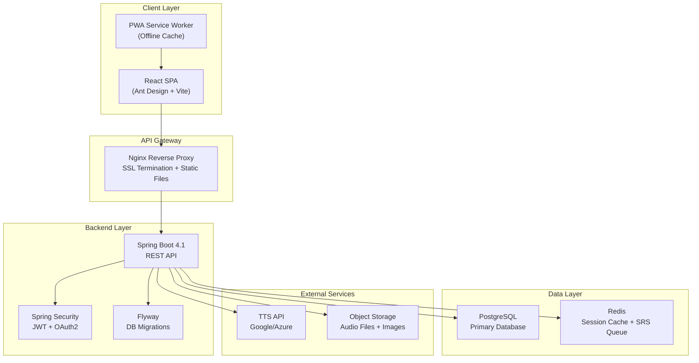
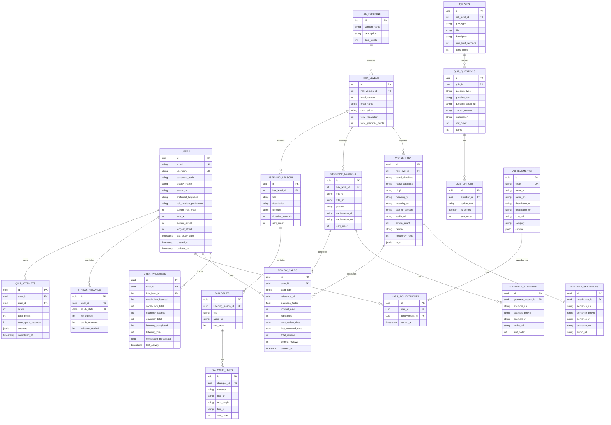

# ☀️ Sun-HSK — Chinese Learning Platform — Project Analysis & Design

## 1. Project Overview

**Sun-HSK** is a full-featured Chinese (Mandarin) learning platform targeting Vietnamese learners preparing for HSK examinations. The platform supports **both HSK 2.0 (HSK 1–6) and HSK 3.0 (HSK 1–9)** standards.

### Core Learning Pillars
| Pillar | Description |
|:---|:---|
| **Vocabulary** | Hanzi, Pinyin, meaning (Vietnamese), example sentences, audio pronunciation |
| **Grammar** | Structured lessons by HSK level |
| **Writing** | Stroke order animation + interactive handwriting practice |
| **Listening** | Audio dialogues, dictation exercises |
| **Speaking** | Record & compare (future: AI speech recognition) |
| **Review** | Flashcards with Spaced Repetition (SM-2/FSRS), quizzes |

### Target Platforms
- 🖥️ Desktop web browser (primary)
- 📱 Mobile web browser (responsive, touch-friendly)
- 📱 Future: PWA for offline study

---

## 2. UI Framework Recommendation

### Comparison Matrix

| Criteria | **Ant Design** | **shadcn/ui + Tailwind** | **MUI (Material UI)** |
|:---|:---|:---|:---|
| CJK Font/Typography | ⭐⭐⭐⭐⭐ Native Chinese support | ⭐⭐⭐⭐ Full control, manual config | ⭐⭐⭐⭐ Good, Western-centric |
| Mobile Responsive | ⭐⭐⭐⭐ + Ant Design Mobile | ⭐⭐⭐⭐⭐ Mobile-first with Tailwind | ⭐⭐⭐⭐ Built-in breakpoints |
| Component Richness | ⭐⭐⭐⭐⭐ 60+ components | ⭐⭐⭐⭐ Growing, copy-paste | ⭐⭐⭐⭐⭐ Massive ecosystem |
| i18n (VN, CN, EN) | ⭐⭐⭐⭐⭐ Built-in ConfigProvider | ⭐⭐⭐ Manual setup | ⭐⭐⭐⭐ Locale adapters |
| Learning Curve | ⭐⭐⭐⭐ Low (well-documented) | ⭐⭐⭐ Moderate (Tailwind required) | ⭐⭐⭐ Moderate (theming) |
| Design Consistency | ⭐⭐⭐⭐⭐ Unified design tokens | ⭐⭐⭐⭐ You own it | ⭐⭐⭐⭐ Material spec |
| Bundle Size | ⭐⭐⭐ Larger | ⭐⭐⭐⭐⭐ Tree-shakeable | ⭐⭐⭐ Larger |
| Data Tables/Forms | ⭐⭐⭐⭐⭐ Pro Table, Form | ⭐⭐⭐ Basic | ⭐⭐⭐⭐⭐ MUI X |
| Community (Asia) | ⭐⭐⭐⭐⭐ Very strong | ⭐⭐⭐⭐ Growing | ⭐⭐⭐⭐ Global |

### ✅ Recommendation: **Ant Design 5.x** (Desktop) + **Ant Design Mobile** (Mobile)

> [!IMPORTANT]
> **Why Ant Design?**
> 1. **Built by Alibaba** — native CJK typography optimization, Chinese character rendering is a first-class concern
> 2. **Ant Design Mobile** — dedicated mobile component library with touch gestures, swipe cards (perfect for flashcards), and mobile-optimized layouts
> 3. **Built-in i18n** — `ConfigProvider` supports Vietnamese, Chinese, English locale switching out of the box
> 4. **Rich data components** — Tables, Forms, Steps, Timeline, Statistic — ideal for learning progress dashboards
> 5. **ProComponents** — Higher-level components for admin/management pages (user management, content management)
> 6. **Design Tokens** — Easy to create a custom "Sun-HSK" theme with consistent branding across all components

### Frontend Tech Stack Summary

| Layer | Technology | Purpose |
|:---|:---|:---|
| **Framework** | React 18+ with Vite | SPA, fast HMR dev experience |
| **UI Library** | Ant Design 5.x + Ant Design Mobile | Desktop & mobile components |
| **Routing** | React Router v7 | Client-side navigation |
| **State Management** | Zustand | Lightweight global state |
| **Forms** | React Hook Form + Zod | Type-safe form validation |
| **HTTP Client** | Axios | API communication |
| **i18n** | react-i18next | Vietnamese, Chinese, English |
| **Hanzi Writing** | Hanzi Writer | Stroke order animation & practice |
| **Audio** | Web Audio API / Howler.js | Pronunciation playback |
| **Charts** | @ant-design/charts | Learning progress visualization |
| **Fonts** | Noto Sans SC + Noto Sans Vietnamese | CJK + Vietnamese typography |

---

## 3. System Architecture



### Architecture Decisions

| Decision | Choice | Rationale |
|:---|:---|:---|
| **Frontend-Backend Separation** | Separate React SPA + Spring Boot API | Better scalability, independent deployment, mobile-ready API |
| **Authentication** | JWT stored in HttpOnly Secure cookies (BFF pattern) | XSS-proof, CSRF-protected, industry standard 2025+ |
| **Database** | PostgreSQL | Already configured, excellent JSON support for flexible data |
| **Migrations** | Flyway (already in pom.xml) | Version-controlled schema evolution |
| **Caching** | Redis (optional Phase 2) | SRS review queue, session management, leaderboard |
| **File Storage** | Local disk → S3/MinIO (production) | Audio files, user avatar images |
| **Deployment** | Docker Compose → Kubernetes | Start simple, scale when needed |

---

## 4. Database Schema Design



---

## 5. Complete User Stories

### Epic 1: Authentication & User Management

| ID | User Story | Priority | Acceptance Criteria |
|:---|:---|:---|:---|
| **US-1.1** | As a **visitor**, I want to **register with email and password** so that I can start learning Chinese | 🔴 Must | Email validation, password strength check, email verification link |
| **US-1.2** | As a **visitor**, I want to **log in with my credentials** so that I can access my learning dashboard | 🔴 Must | JWT token issued, HttpOnly cookie, redirect to dashboard |
| **US-1.3** | As a **user**, I want to **log in with Google/GitHub OAuth** so that I can sign up faster | 🟡 Should | OAuth2 flow, auto-create account, link to existing account |
| **US-1.4** | As a **user**, I want to **reset my password** via email so that I can recover my account | 🔴 Must | Reset token email, token expiration (1h), new password validation |
| **US-1.5** | As a **user**, I want to **edit my profile** (display name, avatar, preferred language) so that I can personalize my experience | 🟡 Should | Avatar upload (max 2MB), language selector (VI/EN/CN) |
| **US-1.6** | As a **user**, I want to **choose between HSK 2.0 and HSK 3.0** tracks so that I study the right standard | 🔴 Must | Toggle in settings, content filters accordingly |
| **US-1.7** | As a **user**, I want to **delete my account** and all associated data so that I can exercise my right to be forgotten | 🟢 Could | Soft delete with 30-day grace period, then hard delete |
| **US-1.8** | As an **admin**, I want to **manage user accounts** (view, disable, role assignment) so that I can maintain platform integrity | 🟡 Should | Admin dashboard, search/filter users, disable/enable accounts |

---

### Epic 2: HSK Level Selection & Learning Path

| ID | User Story | Priority | Acceptance Criteria |
|:---|:---|:---|:---|
| **US-2.1** | As a **new user**, I want to **take a placement test** so that the system recommends the right HSK level for me | 🟡 Should | 20-question adaptive test, recommend HSK level, allow override |
| **US-2.2** | As a **user**, I want to **see all HSK levels** (1–6 for 2.0, 1–9 for 3.0) so that I can choose where to start | 🔴 Must | Level cards with progress %, total vocabulary count, lock/unlock status |
| **US-2.3** | As a **user**, I want to **see my learning roadmap** showing completed, current, and upcoming lessons | 🔴 Must | Visual timeline/stepper, percentage progress, estimated completion time |
| **US-2.4** | As a **user**, I want to **switch between HSK versions** (2.0 ↔ 3.0) without losing progress | 🟡 Should | Progress stored separately per version, clear UI indicator of current version |
| **US-2.5** | As a **user**, I want to **see vocabulary overlap** between HSK 2.0 and 3.0 so that I know what transfers | 🟢 Could | Mapping table showing shared words, unique words per version |

---

### Epic 3: Vocabulary Learning

| ID | User Story | Priority | Acceptance Criteria |
|:---|:---|:---|:---|
| **US-3.1** | As a **user**, I want to **browse vocabulary by HSK level** so that I can study words systematically | 🔴 Must | Paginated list, search, filter by part of speech |
| **US-3.2** | As a **user**, I want to **see a word's detail page** showing Hanzi (simplified + traditional), Pinyin, meaning (VN/EN), example sentences | 🔴 Must | Full word card with all metadata, clickable examples |
| **US-3.3** | As a **user**, I want to **hear the pronunciation** of any word or sentence by clicking a speaker icon | 🔴 Must | Audio playback within 200ms, works on mobile |
| **US-3.4** | As a **user**, I want to **see related words** (synonyms, antonyms, words with same radical) to build connections | 🟡 Should | Related words section on word detail page |
| **US-3.5** | As a **user**, I want to **mark a word as "learned"** so that it tracks in my progress | 🔴 Must | Toggle button, reflected in progress stats |
| **US-3.6** | As a **user**, I want to **search for any Chinese word** across all HSK levels so that I can find specific vocabulary | 🔴 Must | Search by Hanzi, Pinyin, or Vietnamese meaning |
| **US-3.7** | As a **user**, I want to **add words to my personal word list** so that I can create custom study sets | 🟡 Should | "Add to list" button, manage multiple lists, rename/delete lists |
| **US-3.8** | As a **user**, I want to **see which HSK level a word belongs to** so that I understand its difficulty | 🔴 Must | Badge/tag on each word card showing HSK level |

---

### Epic 4: Hanzi Writing Practice (Stroke Order)

| ID | User Story | Priority | Acceptance Criteria |
|:---|:---|:---|:---|
| **US-4.1** | As a **user**, I want to **see the stroke order animation** of any character so that I learn how to write it correctly | 🔴 Must | Animated SVG via Hanzi Writer, play/pause/replay controls |
| **US-4.2** | As a **user**, I want to **practice writing a character** by tracing strokes with mouse/finger so that I memorize the stroke order | 🔴 Must | Interactive canvas, stroke validation, visual feedback (green/red) |
| **US-4.3** | As a **user**, I want to **write a character from memory** (blank canvas, no guide) so that I test my recall | 🟡 Should | Free-draw mode, stroke-by-stroke validation, score (0–100) |
| **US-4.4** | As a **user**, I want to **see a report of which strokes I got wrong** so that I can improve | 🟡 Should | Overlay showing correct vs. user strokes, highlight errors |
| **US-4.5** | As a **user**, I want to **practice writing in sequence** (go through all HSK level characters one by one) | 🟡 Should | Sequential flow with next/previous, skip option |

---

### Epic 5: Grammar Learning

| ID | User Story | Priority | Acceptance Criteria |
|:---|:---|:---|:---|
| **US-5.1** | As a **user**, I want to **browse grammar lessons by HSK level** so that I learn grammar progressively | 🔴 Must | Lesson list with completion status, sorted by difficulty |
| **US-5.2** | As a **user**, I want to **read a grammar lesson** with pattern, explanation (VN), and example sentences | 🔴 Must | Rich formatted content, audio for examples, expandable sections |
| **US-5.3** | As a **user**, I want to **practice grammar with fill-in-the-blank exercises** so that I reinforce my understanding | 🟡 Should | Interactive exercises, instant feedback, explanation on wrong answer |
| **US-5.4** | As a **user**, I want to **mark a grammar point as reviewed** to track progress | 🔴 Must | Checkbox/toggle, reflected in level progress |
| **US-5.5** | As a **user**, I want to **see grammar points that use vocabulary I already know** so that learning is contextual | 🟢 Could | Cross-reference vocabulary and grammar, highlight known words |

---

### Epic 6: Listening Practice

| ID | User Story | Priority | Acceptance Criteria |
|:---|:---|:---|:---|
| **US-6.1** | As a **user**, I want to **listen to dialogues** at normal and slow speed so that I train my ear | 🔴 Must | Audio player with speed controls (0.5x, 0.75x, 1x, 1.25x) |
| **US-6.2** | As a **user**, I want to **read along with the transcript** (CN + Pinyin + VN) while listening | 🔴 Must | Synchronized text highlighting as audio plays |
| **US-6.3** | As a **user**, I want to **do dictation exercises** (listen and type what I hear) so that I improve listening accuracy | 🟡 Should | Audio playback, text input, character-by-character comparison |
| **US-6.4** | As a **user**, I want to **answer comprehension questions** after listening to a dialogue | 🟡 Should | Multiple choice questions, score, review correct answers |
| **US-6.5** | As a **user**, I want to **repeat a specific sentence** in a dialogue so that I can practice difficult parts | 🔴 Must | Click on sentence to replay, loop option |

---

### Epic 7: Speaking Practice

| ID | User Story | Priority | Acceptance Criteria |
|:---|:---|:---|:---|
| **US-7.1** | As a **user**, I want to **record my pronunciation** and compare it side-by-side with the native audio | 🟡 Should | Microphone recording, waveform display, playback both |
| **US-7.2** | As a **user**, I want to **see a visual comparison** (pitch contour) of my pronunciation vs. native | 🟢 Could | Pitch graph overlay, tone accuracy indicator |
| **US-7.3** | As a **user**, I want to **get AI feedback on my pronunciation** (tone accuracy, fluency) | 🔵 Future | Integration with speech recognition API, tone analysis |
| **US-7.4** | As a **user**, I want to **practice reading sentences aloud** and get scored | 🔵 Future | Sentence-level speech recognition, pronunciation scoring |

---

### Epic 8: Flashcards & Spaced Repetition (SRS)

| ID | User Story | Priority | Acceptance Criteria |
|:---|:---|:---|:---|
| **US-8.1** | As a **user**, I want to **review flashcards** (front: Hanzi, back: Pinyin + meaning) using spaced repetition | 🔴 Must | SM-2 algorithm, daily review queue, swipe/button navigation |
| **US-8.2** | As a **user**, I want to **rate my recall** (Again / Hard / Good / Easy) after seeing a flashcard answer | 🔴 Must | 4-button rating, affects next review interval, visual feedback |
| **US-8.3** | As a **user**, I want to **see how many cards are due today** on my dashboard | 🔴 Must | Badge count on dashboard, categorized: new/review/learning |
| **US-8.4** | As a **user**, I want to **create custom flashcard decks** from my word lists | 🟡 Should | Select words from lists, name the deck, study independently |
| **US-8.5** | As a **user**, I want to **see my review forecast** (how many cards due this week) so I can plan study time | 🟡 Should | Calendar/bar chart showing upcoming reviews per day |
| **US-8.6** | As a **user**, I want to **reverse flashcard mode** (show meaning first, recall Hanzi) for variety | 🟡 Should | Toggle between CN→VN and VN→CN modes |
| **US-8.7** | As a **user**, I want **audio flashcards** (hear the word, recall meaning) for listening training | 🟡 Should | Audio auto-plays on card front, user recalls meaning |
| **US-8.8** | As a **user**, I want to **see my SRS statistics** (retention rate, total reviews, average ease) | 🟡 Should | Statistics page with charts, filter by date range |

---

### Epic 9: Quizzes & Tests

| ID | User Story | Priority | Acceptance Criteria |
|:---|:---|:---|:---|
| **US-9.1** | As a **user**, I want to **take a vocabulary quiz** (multiple choice) for a specific HSK level | 🔴 Must | Randomized questions, timer, score at end, review answers |
| **US-9.2** | As a **user**, I want to **take a listening quiz** (listen and choose the correct answer) | 🟡 Should | Audio playback, 4 options, immediate or end-of-quiz feedback |
| **US-9.3** | As a **user**, I want to **take a grammar quiz** (fill in blanks, choose correct pattern) | 🟡 Should | Various question types, explanation for wrong answers |
| **US-9.4** | As a **user**, I want to **take a mock HSK exam** simulating the real test format and time limit | 🟢 Could | Full exam structure, timed sections, final score + analysis |
| **US-9.5** | As a **user**, I want to **see my quiz history** and review past mistakes | 🔴 Must | History table, filter by quiz type/level, re-do wrong questions |
| **US-9.6** | As a **user**, I want **adaptive difficulty** — the system gives me harder questions if I'm doing well | 🔵 Future | Algorithm adjusts question difficulty based on recent performance |

---

### Epic 10: Gamification & Motivation

| ID | User Story | Priority | Acceptance Criteria |
|:---|:---|:---|:---|
| **US-10.1** | As a **user**, I want to **earn XP** for every study activity so that I feel a sense of progress | 🔴 Must | XP awarded: flashcard review (+5), quiz pass (+20), lesson complete (+15) |
| **US-10.2** | As a **user**, I want to **maintain a daily streak** that tracks consecutive study days | 🔴 Must | Streak counter, streak freeze option, streak recovery (premium?) |
| **US-10.3** | As a **user**, I want to **earn achievement badges** for milestones (100 words learned, 7-day streak, etc.) | 🟡 Should | Badge gallery, unlock animation, shareable |
| **US-10.4** | As a **user**, I want to **see a leaderboard** comparing my XP with other learners | 🟡 Should | Weekly/monthly/all-time leaderboards, friend comparison |
| **US-10.5** | As a **user**, I want to **set daily study goals** (e.g., 10 new words, 30 minutes) and track them | 🟡 Should | Goal setting page, daily progress ring, notification if behind |
| **US-10.6** | As a **user**, I want to **receive encouraging notifications/reminders** to maintain my streak | 🟢 Could | Push notification or email, customizable timing |

---

### Epic 11: Dashboard & Analytics

| ID | User Story | Priority | Acceptance Criteria |
|:---|:---|:---|:---|
| **US-11.1** | As a **user**, I want to **see a dashboard** summarizing today's tasks, streak, XP, and due reviews | 🔴 Must | Cards: due reviews, streak, XP today, current level progress |
| **US-11.2** | As a **user**, I want to **see my learning statistics** (words learned over time, accuracy, study time) | 🟡 Should | Line/bar charts, date range selector, exportable |
| **US-11.3** | As a **user**, I want to **see a heatmap** of my study activity (like GitHub contribution graph) | 🟡 Should | Calendar heatmap, color intensity by activity |
| **US-11.4** | As a **user**, I want to **see my weak areas** (words with low retention, frequently wrong quiz topics) | 🟡 Should | "Weak words" list, suggestion to focus on them |

---

### Epic 12: Community & Social (Phase 3+)

| ID | User Story | Priority | Acceptance Criteria |
|:---|:---|:---|:---|
| **US-12.1** | As a **user**, I want to **ask questions in a forum** organized by HSK level | 🔵 Future | Post/reply, tag by level/topic, upvote/downvote |
| **US-12.2** | As a **user**, I want to **add friends** and see their learning progress | 🔵 Future | Friend requests, mutual progress view, challenge a friend |
| **US-12.3** | As a **user**, I want to **share my achievements** on social media | 🔵 Future | Generate shareable image, links to Twitter/Facebook |

---

### Epic 13: Content Management (Admin)

| ID | User Story | Priority | Acceptance Criteria |
|:---|:---|:---|:---|
| **US-13.1** | As an **admin**, I want to **manage vocabulary data** (CRUD) so that I can maintain accurate content | 🔴 Must | Admin panel with data table, inline editing, bulk import/export |
| **US-13.2** | As an **admin**, I want to **upload audio files** for vocabulary and sentences | 🔴 Must | File upload, audio preview, link to vocabulary record |
| **US-13.3** | As an **admin**, I want to **manage grammar lessons** (CRUD with rich text editor) | 🔴 Must | Rich editor, preview, sort order management |
| **US-13.4** | As an **admin**, I want to **create and manage quizzes** with different question types | 🟡 Should | Quiz builder, question bank, preview before publish |
| **US-13.5** | As an **admin**, I want to **bulk import HSK vocabulary** from JSON/CSV files | 🔴 Must | Upload file, validation report, preview before confirm |
| **US-13.6** | As an **admin**, I want to **see platform analytics** (total users, active users, popular levels) | 🟡 Should | Admin dashboard with key metrics, time-based charts |

---

### Epic 14: System / Non-Functional Requirements

| ID | User Story | Priority | Acceptance Criteria |
|:---|:---|:---|:---|
| **US-14.1** | As a **user**, I want the **app to load in under 3 seconds** so that I don't lose motivation | 🔴 Must | Lighthouse score > 90, code splitting, lazy loading |
| **US-14.2** | As a **user**, I want the **app to work well on my phone** (responsive layout, touch-friendly) | 🔴 Must | Responsive breakpoints, min-tap-target 44px, no horizontal scroll |
| **US-14.3** | As a **user**, I want **Chinese characters to render clearly** at all sizes | 🔴 Must | Noto Sans SC font loaded, proper font-size scaling, anti-aliasing |
| **US-14.4** | As a **user**, I want to **switch UI language** (Vietnamese / English / Chinese) | 🟡 Should | Language selector in header, all static text translated |
| **US-14.5** | As a **developer**, I want **comprehensive API documentation** so that the frontend team can work independently | 🔴 Must | Swagger/OpenAPI docs auto-generated, available at /api-docs |
| **US-14.6** | As a **sysadmin**, I want **Docker deployment** so that I can deploy consistently | 🟡 Should | Dockerfile, docker-compose.yml, environment variable config |
| **US-14.7** | As a **sysadmin**, I want **health checks and monitoring** for the production system | 🟡 Should | Spring Actuator endpoints, uptime monitoring, error alerting |
| **US-14.8** | As a **user**, I want my **data to be secure** (encrypted passwords, HTTPS, protected APIs) | 🔴 Must | BCrypt hashing, TLS everywhere, role-based access control |

---

## 6. API Design Overview

### REST API Structure

```
/api/v1
├── /auth
│   ├── POST   /register          — Register new user
│   ├── POST   /login             — Login (returns JWT cookie)
│   ├── POST   /logout            — Logout (clears cookie)
│   ├── POST   /refresh           — Refresh access token
│   ├── POST   /forgot-password   — Request password reset
│   └── POST   /reset-password    — Reset password with token
│
├── /users
│   ├── GET    /me                — Get current user profile
│   ├── PUT    /me                — Update profile
│   ├── PUT    /me/avatar         — Upload avatar
│   ├── PUT    /me/preferences    — Update study preferences
│   ├── GET    /me/stats          — Get personal statistics
│   └── DELETE /me                — Delete account
│
├── /hsk
│   ├── GET    /versions          — List HSK versions (2.0, 3.0)
│   └── GET    /versions/{id}/levels — List levels for a version
│
├── /vocabulary
│   ├── GET    /                  — List vocabulary (filter: level, search, POS)
│   ├── GET    /{id}              — Get word detail
│   ├── GET    /{id}/examples     — Get example sentences
│   ├── GET    /{id}/related      — Get related words
│   └── POST   /{id}/learned      — Mark as learned/unlearned
│
├── /grammar
│   ├── GET    /                  — List grammar lessons (filter: level)
│   ├── GET    /{id}              — Get lesson detail with examples
│   └── POST   /{id}/completed    — Mark as completed
│
├── /listening
│   ├── GET    /                  — List listening lessons (filter: level)
│   ├── GET    /{id}              — Get lesson with dialogues
│   └── GET    /{id}/audio        — Stream audio file
│
├── /review
│   ├── GET    /due               — Get today's due flashcards
│   ├── GET    /stats             — Get SRS statistics
│   ├── GET    /forecast          — Get review forecast (next 7 days)
│   ├── POST   /cards             — Create new review card
│   └── POST   /cards/{id}/review — Submit review result (rating)
│
├── /quizzes
│   ├── GET    /                  — List available quizzes (filter: level, type)
│   ├── GET    /{id}              — Get quiz with questions
│   ├── POST   /{id}/attempt      — Submit quiz attempt
│   └── GET    /history           — Get past quiz attempts
│
├── /progress
│   ├── GET    /                  — Get overall progress
│   ├── GET    /levels/{id}       — Get progress for specific level
│   ├── GET    /streak            — Get streak data
│   └── GET    /heatmap           — Get activity heatmap data
│
├── /gamification
│   ├── GET    /xp                — Get XP breakdown
│   ├── GET    /achievements      — Get earned + available badges
│   ├── GET    /leaderboard       — Get leaderboard (weekly/monthly/all)
│   └── GET    /goals             — Get daily goals + progress
│
└── /admin
    ├── /vocabulary
    │   ├── POST   /              — Create vocabulary
    │   ├── PUT    /{id}          — Update vocabulary
    │   ├── DELETE /{id}          — Delete vocabulary
    │   └── POST   /import        — Bulk import from JSON/CSV
    ├── /grammar
    │   ├── POST   /              — Create lesson
    │   ├── PUT    /{id}          — Update lesson
    │   └── DELETE /{id}          — Delete lesson
    ├── /quizzes
    │   ├── POST   /              — Create quiz
    │   ├── PUT    /{id}          — Update quiz
    │   └── DELETE /{id}          — Delete quiz
    ├── /users
    │   ├── GET    /              — List all users
    │   ├── PUT    /{id}/status   — Enable/disable user
    │   └── PUT    /{id}/role     — Change user role
    └── /analytics
        └── GET    /dashboard     — Platform-wide statistics
```

---

## 7. Open Data Sources

| Resource | URL | Data |
|:---|:---|:---|
| **complete-hsk-vocabulary** | github.com/drkameleon/complete-hsk-vocabulary | HSK 2.0 + 3.0 vocabulary JSON (Hanzi, Pinyin, meaning, POS, frequency) |
| **HSK 3.0 dataset** | github.com/krmanik/HSK-3.0 | HSK 3.0 levels 1–9, grammar, stroke data |
| **ivankra/hsk30** | github.com/ivankra/hsk30 | Clean HSK 3.0 with traditional/simplified variants |
| **Hanzi Writer** | hanziwriter.org | Stroke order data for 9,000+ characters (open source) |
| **Google TTS / Azure TTS** | cloud.google.com/text-to-speech | Chinese Mandarin pronunciation (cmn-CN) |
| **Noto Sans SC** | fonts.google.com/noto/specimen/Noto+Sans+SC | Open-source Chinese font by Google |

---

## 8. Phased Implementation Roadmap

### Phase 1 — Foundation (4–6 weeks)
> Backend API core + Frontend shell + Authentication + Vocabulary browsing

| Component | Tasks |
|:---|:---|
| **Backend** | Project structure, PostgreSQL config, Flyway migrations (users, vocabulary, HSK tables), JWT auth, vocabulary CRUD API, HSK data seeding |
| **Frontend** | Vite + React + Ant Design setup, routing, auth pages (login/register), HSK level selector, vocabulary browser, word detail page |
| **DevOps** | Docker Compose (Spring Boot + PostgreSQL), API docs (Swagger) |
| **User Stories** | US-1.1, US-1.2, US-1.4, US-1.6, US-2.2, US-3.1, US-3.2, US-3.3, US-3.5, US-3.6, US-3.8, US-14.2, US-14.3, US-14.5 |

### Phase 2 — Core Learning Features (4–6 weeks)
> Stroke writing + Grammar + Flashcards (SRS) + Quizzes + Dashboard

| Component | Tasks |
|:---|:---|
| **Backend** | Grammar API, Review cards + SM-2 algorithm, Quiz engine, progress tracking, XP system |
| **Frontend** | Hanzi Writer integration, grammar lesson pages, flashcard review UI, quiz UI, learning dashboard |
| **User Stories** | US-4.1, US-4.2, US-5.1, US-5.2, US-5.4, US-8.1, US-8.2, US-8.3, US-9.1, US-9.5, US-10.1, US-10.2, US-11.1 |

### Phase 3 — Engagement & Polish (3–4 weeks)
> Listening, gamification, analytics, admin panel

| Component | Tasks |
|:---|:---|
| **Backend** | Listening lessons API, achievement system, leaderboard, admin CRUD endpoints |
| **Frontend** | Audio player with transcript sync, achievement badges, leaderboard, study heatmap, admin panel |
| **User Stories** | US-6.1, US-6.2, US-6.5, US-8.5, US-8.8, US-10.3, US-10.4, US-10.5, US-11.2, US-11.3, US-13.1–US-13.6 |

### Phase 4 — Advanced & Community (ongoing)
> Speaking practice, AI features, community, PWA offline

| Component | Tasks |
|:---|:---|
| **Backend** | Speech recognition integration, forum/community, notification system |
| **Frontend** | Recording + waveform comparison, forum UI, PWA service worker, push notifications |
| **User Stories** | US-7.1–US-7.4, US-9.4, US-9.6, US-12.1–US-12.3 |

---

## 9. Key Technical Decisions Needed

> [!IMPORTANT]
> ### Decisions requiring your input before starting Phase 1:
> 
> 1. **Database hosting**: Do you have PostgreSQL installed locally, or should we use Docker Compose / H2 for development?
> 2. **Frontend repository**: Should the React frontend live inside this same Git repo (monorepo) or in a separate repository?
> 3. **Vietnamese translations**: Do you have Vietnamese translations for HSK vocabulary, or should we start with English meanings and add Vietnamese later?
> 4. **Audio pronunciation**: Use Google Cloud TTS (requires API key, paid) or pre-recorded audio files? Or start without audio and add later?
> 5. **Deployment target**: Where do you plan to deploy? (VPS, AWS, Google Cloud, Vercel+Railway, etc.)
> 6. **Domain name**: Do you have a domain name for production?

> [!WARNING]
> ### Risk Factors
> - **HSK data licensing**: Open-source HSK word lists are community-maintained; verify accuracy before production
> - **Audio storage costs**: Thousands of audio files need hosting; plan storage budget
> - **Speech recognition**: US-7.3 and US-7.4 require third-party AI services with ongoing costs
> - **Scale**: SM-2 computation at scale needs Redis caching for review queues

---

## 10. Project Structure (Proposed)

```
Sun-HSK/
├── pom.xml
├── docker-compose.yml
├── src/main/java/com/Kiet/Sun_HSK/
│   ├── SunHskApplication.java
│   ├── config/
│   │   ├── SecurityConfig.java
│   │   ├── CorsConfig.java
│   │   ├── SwaggerConfig.java
│   │   └── JwtConfig.java
│   ├── auth/
│   │   ├── controller/AuthController.java
│   │   ├── service/AuthService.java
│   │   ├── dto/LoginRequest.java
│   │   ├── dto/RegisterRequest.java
│   │   └── jwt/JwtTokenProvider.java
│   ├── user/
│   │   ├── model/User.java
│   │   ├── repository/UserRepository.java
│   │   ├── service/UserService.java
│   │   ├── controller/UserController.java
│   │   └── dto/...
│   ├── hsk/
│   │   ├── model/HskVersion.java
│   │   ├── model/HskLevel.java
│   │   ├── repository/...
│   │   ├── service/HskService.java
│   │   └── controller/HskController.java
│   ├── vocabulary/
│   │   ├── model/Vocabulary.java
│   │   ├── model/ExampleSentence.java
│   │   ├── repository/...
│   │   ├── service/VocabularyService.java
│   │   └── controller/VocabularyController.java
│   ├── grammar/
│   │   ├── model/...
│   │   ├── service/...
│   │   └── controller/...
│   ├── listening/
│   │   ├── model/...
│   │   ├── service/...
│   │   └── controller/...
│   ├── review/
│   │   ├── model/ReviewCard.java
│   │   ├── service/SrsService.java (SM-2 algorithm)
│   │   └── controller/ReviewController.java
│   ├── quiz/
│   │   ├── model/...
│   │   ├── service/...
│   │   └── controller/...
│   ├── gamification/
│   │   ├── model/Achievement.java
│   │   ├── service/XpService.java
│   │   ├── service/StreakService.java
│   │   └── controller/GamificationController.java
│   ├── admin/
│   │   └── controller/AdminController.java
│   └── common/
│       ├── exception/GlobalExceptionHandler.java
│       ├── dto/ApiResponse.java
│       └── util/...
├── src/main/resources/
│   ├── application.yml
│   ├── application-dev.yml
│   ├── application-prod.yml
│   └── db/migration/
│       ├── V1__create_users_table.sql
│       ├── V2__create_hsk_tables.sql
│       ├── V3__create_vocabulary_tables.sql
│       └── ...
└── frontend/                          ← React app (monorepo)
    ├── package.json
    ├── vite.config.ts
    ├── src/
    │   ├── main.tsx
    │   ├── App.tsx
    │   ├── api/                       ← Axios API clients
    │   ├── components/                ← Shared components
    │   ├── pages/                     ← Route pages
    │   │   ├── auth/
    │   │   ├── dashboard/
    │   │   ├── vocabulary/
    │   │   ├── grammar/
    │   │   ├── writing/
    │   │   ├── listening/
    │   │   ├── review/
    │   │   ├── quiz/
    │   │   └── admin/
    │   ├── hooks/                     ← Custom React hooks
    │   ├── stores/                    ← Zustand stores
    │   ├── i18n/                      ← Translation files
    │   │   ├── vi.json
    │   │   ├── en.json
    │   │   └── zh.json
    │   ├── theme/                     ← Ant Design theme tokens
    │   └── utils/
    └── public/
        └── fonts/
```
